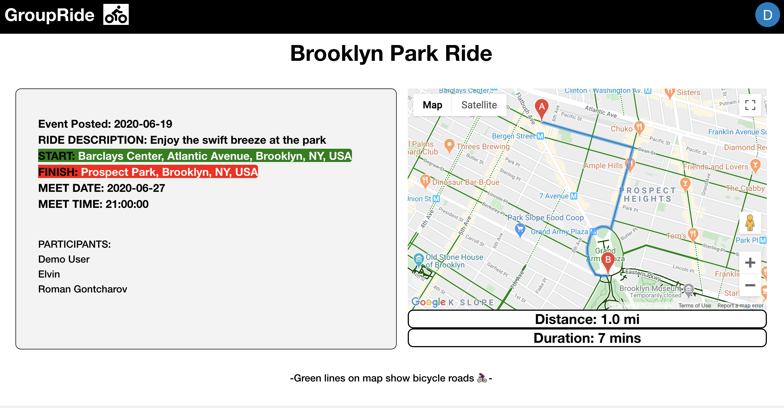

# GroupRide

[GroupRide](https://groupride-aa.herokuapp.com/#/) is a social media app that allows bike riders to create an share ride events. These ride events are posted onto the app's main page so that other users can see them and decide if they want to join the event by clicking a join button. Groupride allows people to ride their bicycles in groups so that they feel safer.

## Technologies Used

* Frontend
  * React
  * Redux
  * CSS3

* Backend
  * Express
  * Node.js
  * Mongo.db
  * Mongoose

* Libraries/API
  * Google Maps API
  * FontAwesome

## Features and MVP's

### User Authentication

Users are able to sign in to the application by entering email, username and password or login with their email and password. The application's forms for login and sign up will show errors in case of any of the fields being invalid. 

### Ride / Event creator

Users will be able to create Rides / Events so that they can be posted to the main page and to their personal page. These events will allow others to decide if they want to join these events by clicking the join button.

### Goggle Maps 

On creation of the route, a map showing the Event's route will display next to the event's details allowing users to see an actual map of the route along with the specific details (Time and Distance) of the ride obtained from the Google Maps API. The Google Maps API was also use in the Create Ride form to display autocomplete on the location inputs. These inputs will show locations that match the user's input on Google Maps.

### Participants and Detailed information

When a user clicks on the show details button of an Event, the user will be redirected to the event's page where the user will be able to see the participants planning to attend that event

### Later Additions

* Users can comment on Ride Events
* Likes on events
* Follow User
* Social Media (Facebook, Intagram ...) verification. 

